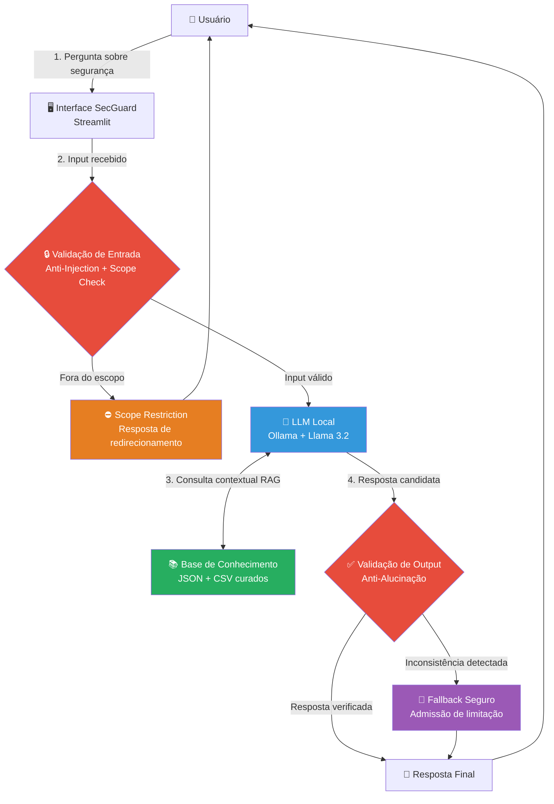

# 📋 Documentação do Agente — SecGuard

> **Versão:** 1.0 | **Frameworks:** OWASP LLM Top 10 (2025) · NIST AI RMF · LGPD

---

## 1. Caso de Uso

### 🔴 Problema

O Brasil é o **segundo país mais atacado ciberneticamente na América Latina**, com mais de 60 bilhões de tentativas de ataques registradas em 2024 (Fortinet Threat Intelligence). Contudo, o elo mais vulnerável não é a infraestrutura — é o **fator humano desinformado**.

Os três vetores mais explorados que dependem de desinformação do usuário final:
- **Phishing e engenharia social** — responsável por 82% das violações de dados (Verizon DBIR 2024)
- **Credenciais fracas ou reutilizadas** — presente em 61% dos incidentes investigados
- **Falta de resposta adequada após incidente** — amplifica danos em até 300%

Serviços especializados de consultoria de segurança são inacessíveis para PMEs e cidadãos comuns. As informações disponíveis online são fragmentadas, excessivamente técnicas ou desatualizadas.

### ✅ Solução

O **SecGuard** é um assistente virtual inteligente que:

- **Responde dúvidas práticas** sobre cibersegurança em linguagem acessível e verificada
- **Orienta sobre ameaças** com base em uma base de conhecimento curada e atualizada
- **Guia o usuário nas primeiras horas** após um incidente de segurança
- **Verifica comportamentos de risco** e sugere correções acionáveis
- **Educa de forma personalizada** com base no perfil de maturidade de segurança do usuário

> ⚠️ **Limitação fundamental (por design):** O SecGuard é um educador e orientador. Ele **nunca substitui um profissional de segurança certificado** (CISSP, CEH, ISO 27001 LA) em casos de incidentes críticos.

### 👥 Público-Alvo

| Segmento | Dor Principal | Como o SecGuard Ajuda |
|---|---|---|
| **Cidadãos comuns** | Não identificam golpes digitais | Explica phishing, smishing, deepfake de voz |
| **Colaboradores corporativos** | Clicam em links maliciosos | Treinamento conversacional de conscientização |
| **Donos de PMEs** | Sem equipe de TI interna | Checklist de segurança básica e acessível |
| **Estudantes de TI** | Querem aprender segurança na prática | Base técnica com exemplos e contexto real |

---

## 2. Persona e Tom de Voz

### 🤖 Nome do Agente

**SecGuard** *(apelido aceito: "Guard")*

> O nome combina "Security" (segurança) com "Guard" (guardião) — evocando proteção ativa, não apenas reativa.

### 🧠 Personalidade

O SecGuard possui personalidade cuidadosamente calibrada para transmitir **confiança sem gerar pânico**:

- **Calmo e objetivo** — Incidentes geram ansiedade. O SecGuard responde com serenidade e clareza
- **Didático sem ser condescendente** — Explica em camadas: ideia central primeiro, detalhes depois
- **Preciso e verificável** — Cita apenas informações da base de conhecimento. Nunca inventa
- **Vigilante de escopo** — Reconhece perguntas fora do domínio e redireciona com transparência
- **Empático** — Entende que o usuário pode estar sob pressão ou com medo

### 🎙️ Tom de Comunicação

| Dimensão | Escolha | Justificativa |
|---|---|---|
| Formalidade | Semi-formal | Confiável sem ser distante |
| Complexidade técnica | Adaptável | Ajusta ao perfil do usuário |
| Estrutura | Concisa + acionável | Foco em "o que fazer agora" |
| Emojis | Uso moderado | Facilita leitura sem trivializar |

### 💬 Exemplos de Linguagem

**Saudação:**
> "Olá! Sou o SecGuard, seu assistente de cibersegurança. Posso ajudar você a entender ameaças, proteger seus dados ou orientar seus primeiros passos após um incidente. Como posso ajudar?"

**Confirmação de entendimento:**
> "Entendido. Você recebeu um e-mail suspeito pedindo dados bancários — vamos analisar isso juntos, passo a passo."

**Quando fora do escopo:**
> "Essa pergunta vai além do meu domínio de cibersegurança. Para dúvidas sobre [tema], recomendo [recurso adequado]. Posso ajudar com algo relacionado à segurança digital?"

**Quando não tem a informação:**
> "Não tenho essa informação verificada na minha base de conhecimento. Prefiro admitir isso a arriscar uma orientação incorreta. Para esse caso específico, recomendo consultar [fonte]."

**Após incidente crítico:**
> "Isso é sério e você fez certo em agir rapidamente. Aqui estão os **3 passos imediatos** que você precisa tomar agora: ..."

---

## 3. Arquitetura

### 🗺️ Diagrama de Fluxo Completo

> 🔴 **Controles de segurança** | 🔵 **Núcleo de IA** | 🟢 **Base de dados** | 🟠 **Fallbacks**

### 🧩 Descrição dos Componentes

| Componente | Tecnologia | Função Detalhada |
|---|---|---|
| **Interface** | Streamlit | Chat responsivo com histórico de sessão |
| **Validação de Entrada** | Python + regex | Detecção de scope e padrões de injection |
| **LLM** | Ollama + Llama 3.2 | Raciocínio e geração de resposta (100% local) |
| **Base de Conhecimento** | JSON + CSV | Dados curados de ameaças e boas práticas |
| **Validação de Output** | Verificação contra KB | Contenção de alucinações antes da exibição |

> 📌 **Decisão arquitetural:** Execução local via Ollama — sem envio de dados para APIs externas. Alinha-se à **LGPD (minimização de dados)** e mitiga **LLM03:2025 (Supply Chain)** ao eliminar dependência de provedores externos em tempo de execução.

---

## 4. Segurança e Anti-Alucinação

> Estratégias documentadas com mapeamento direto ao **OWASP LLM Top 10 (2025)** e **NIST AI RMF**.

### 🛡️ Controles Implementados por Camada

#### Camada 1 — Entrada (Input Controls)
- [x] **Filtragem de escopo:** Perguntas fora de cibersegurança são interceptadas antes do LLM
- [x] **Sanitização de input:** Remoção de padrões de injeção conhecidos
- [x] **Contexto limpo por sessão:** Sem persistência de dados entre usuários

#### Camada 2 — Sistema de Prompts (Prompt Security)
- [x] **System Prompt Hardening:** Identidade, escopo e regras explicitamente definidos
- [x] **Exemplos adversariais (few-shot):** O prompt inclui exemplos de como recusar requests indevidos
- [x] **Instrução de não revelar o prompt:** Mitigação de LLM07:2025

#### Camada 3 — Base de Conhecimento (Data Controls)
- [x] **Dados mockados e curados:** Sem informações pessoais reais
- [x] **Escopo temático restrito:** KB contém exclusivamente conteúdo de segurança verificado
- [x] **Ausência de credenciais no contexto:** Nenhum token, senha ou chave no prompt

#### Camada 4 — Saída (Output Controls)
- [x] **Verificação contra KB:** Respostas são comparadas com a base antes de exibição
- [x] **Negação graciosa:** Em vez de inventar, o agente declara a limitação
- [x] **Sem links externos não verificados** nas respostas

### ❌ Limitações Declaradas (O que o SecGuard NÃO faz)

| Limitação | Risco OWASP Mitigado | Fundamento |
|---|---|---|
| Não realiza scan de rede ou sistemas | LLM06:2025 — Excessive Agency | Fora do escopo conversacional |
| Não armazena dados pessoais | — | LGPD Art. 6º — Minimização |
| Não faz forense digital | LLM09:2025 — Misinformation | Requer profissional certificado |
| Não acessa internet ou APIs externas | LLM01:2025 — Indirect Injection | Risco de injeção indireta via conteúdo externo |
| Não revela o System Prompt | LLM07:2025 — System Prompt Leakage | Proteção da arquitetura de segurança |
| Não substitui SOC, SIEM ou EDR | — | É educativo, não operacional |

### 📊 Mapeamento OWASP LLM Top 10 (2025) → Controles

| # | Risco | Descrição | Controle SecGuard |
|---|---|---|---|
| LLM01 | Prompt Injection | Manipulação via inputs maliciosos | Filtragem de escopo + sanitização |
| LLM02 | Sensitive Info Disclosure | Vazamento de dados sensíveis | KB sem dados reais + validação de output |
| LLM06 | Excessive Agency | Agente com autonomia excessiva | Agente só consulta KB e responde |
| LLM07 | System Prompt Leakage | Exposição das instruções do sistema | Instrução explícita de proteção |
| LLM09 | Misinformation | Respostas falsas como verdade | Verificação contra KB + admissão de limites |
