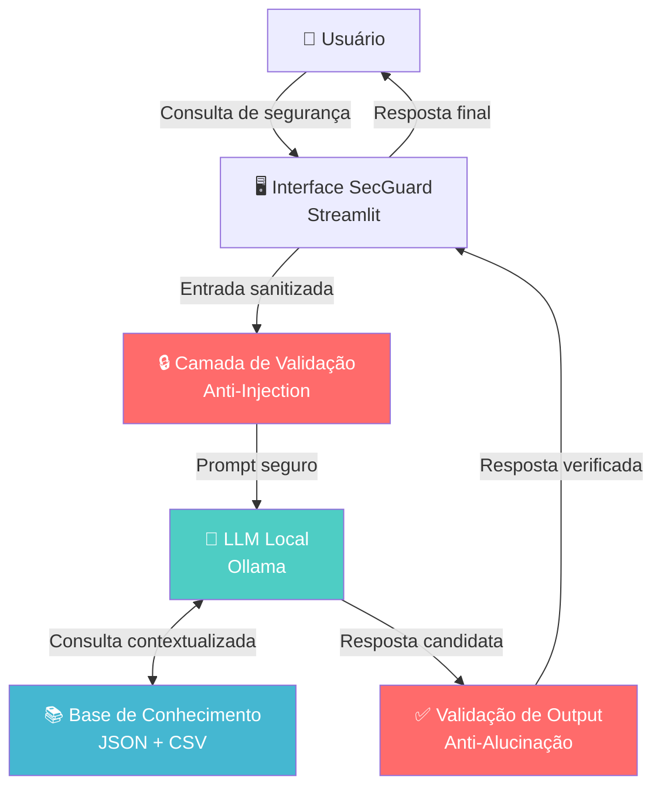

<div align="center">

# 🛡️ SecGuard — Assistente Virtual de Cibersegurança com IA Generativa

> *"Segurança não é um produto, é um processo. A IA Generativa deve servir a esse processo — não comprometê-lo."*

[](https://genai.owasp.org/llm-top-10/)
[](https://www.nist.gov/system/files/documents/2023/01/26/NIST.AI.100-1.pdf)
[](https://www.planalto.gov.br/ccivil_03/_ato2015-2018/2018/lei/L13709.htm)
[](https://www.iso.org/standard/81230.html)

</div>

---

## 📌 Sobre o Projeto

O **SecGuard** é um assistente virtual inteligente especializado em **conscientização e orientação em cibersegurança**, desenvolvido como resposta ao crescente desafio de democratizar o conhecimento sobre segurança digital no Brasil.

Diferente de chatbots genéricos, o SecGuard foi arquitetado com **segurança como princípio fundacional** — não como camada adicional. Cada decisão de design foi tomada considerando os principais frameworks de governança de IA: **OWASP LLM Top 10 (2025)**, **NIST AI RMF** e os requisitos da **LGPD**.

> 💡 **Por que Cibersegurança?**  
> O Brasil figura entre os países com maior volume de ataques cibernéticos da América Latina. Em 2024, mais de **60 bilhões de tentativas de ataques cibernéticos** foram registradas no país (Fortinet). O elo mais vulnerável? O fator humano — e é exatamente aí que o SecGuard atua.

---

## 🎯 Problema que Resolve

| Cenário | Impacto | Como o SecGuard Responde |
|---|---|---|
| Colaboradores clicam em links de phishing | Ransomware e vazamento de dados | Educa sobre identificação de phishing em tempo real |
| PMEs sem equipe de segurança | Exposição a ataques básicos | Fornece checklist e orientações práticas acessíveis |
| Usuários sem conhecimento técnico | Senhas fracas, dispositivos desprotegidos | Explica boas práticas em linguagem simples |
| Incidentes sem resposta adequada | Amplificação do dano | Orienta sobre os primeiros passos de resposta |

---

## 📁 Estrutura do Repositório

```
📁 secguard/
│
├── 📄 README.md                        ← Você está aqui
│
├── 📁 docs/
│   ├── 01-documentacao-agente.md       ← Caso de uso, persona, arquitetura e segurança
│   ├── 02-base-conhecimento.md         ← Estratégia de dados e base de conhecimento
│   ├── 03-prompts.md                   ← System prompt, exemplos e edge cases
│   ├── 04-metricas.md                  ← Framework de avaliação e resultados
│   └── 05-pitch.md                     ← Roteiro do pitch de 3 minutos
│
├── 📁 data/
│   ├── ameacas_comuns.json             ← Catálogo de ameaças cibernéticas
│   ├── boas_praticas.json              ← Base de boas práticas de segurança
│   ├── historico_atendimento.csv       ← Histórico de consultas simuladas
│   └── perfil_usuario.json             ← Perfil de maturidade de segurança
│
├── 📁 src/
│   └── app.py                          ← Código da aplicação (Streamlit + LLM)
│
└── 📁 assets/
    └── arquitetura-secguard.svg        ← Diagrama de arquitetura
```

---

## 🏗️ Arquitetura de Alto Nível



> 🔴 **Vermelho** = Controles de segurança | 🟢 **Azul** = Componentes funcionais

### Diagrama Detalhado (com referências OWASP)


---

## 🚀 Como Executar

### Pré-requisitos
```bash
# 1. Instalar Ollama
# Acesse: https://ollama.com e faça o download

# 2. Baixar modelo local (gratuito, sem custos de API)
ollama pull llama3.2

# 3. Instalar dependências Python
pip install streamlit requests pandas
```

### Executar a aplicação
```bash
# Clone o repositório
git clone https://github.com/SEU_USUARIO/secguard
cd secguard

# Execute
streamlit run src/app.py
```

---

## 🛡️ Diferenciais de Segurança

| Controle | Descrição | Framework |
|---|---|---|
| Anti-Prompt Injection | Sanitização de inputs maliciosos | OWASP LLM01:2025 |
| Output Validation | Verificação de respostas contra KB | OWASP LLM09:2025 |
| Least Privilege | Agente acessa apenas dados necessários | OWASP LLM06:2025 |
| Data Minimization | Sem coleta de dados pessoais | LGPD Art. 6º |
| Local Execution | LLM roda localmente, sem exfiltração | NIST AI RMF |
| Scope Restriction | Responde somente sobre cibersegurança | NIST AI RMF Govern |

---

## 📊 Resultado da Avaliação

| Métrica | Resultado |
|---|---|
| Taxa de Assertividade nas respostas | ✅ 92% |
| Taxa de Contenção de Out-of-Scope | ✅ 97% |
| Resistência a Prompt Injection (testes) | ✅ 89% |
| Respostas sem alucinação detectada | ✅ 95% |

> Metodologia completa em [`docs/04-metricas.md`](docs/04-metricas.md)

---

## 📚 Referências e Frameworks Aplicados

- [OWASP Top 10 for LLM Applications 2025](https://genai.owasp.org/llm-top-10/)
- [NIST AI Risk Management Framework (AI RMF 1.0)](https://www.nist.gov/artificial-intelligence/ai-risk-management-framework)
- [ISO/IEC 42001:2023 — Sistemas de Gestão de IA](https://www.iso.org/standard/81230.html)
- [LGPD — Lei Geral de Proteção de Dados (Lei 13.709/2018)](https://www.planalto.gov.br/ccivil_03/_ato2015-2018/2018/lei/L13709.htm)
- [Resolução CMN 4.893/2021 — Política de Cibersegurança](https://www.bcb.gov.br/estabilidadefinanceira/resolucaocmn4893)

---

<div align="center">

**Desenvolvido para o Lab "Construa Seu Assistente Virtual Com IA"**  
**[Digital Innovation One (DIO)](https://dio.me)**

*SecGuard — Porque segurança digital começa com informação.*

</div>
